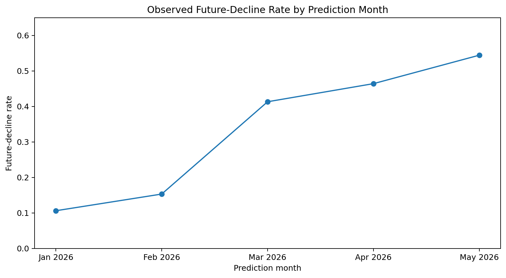
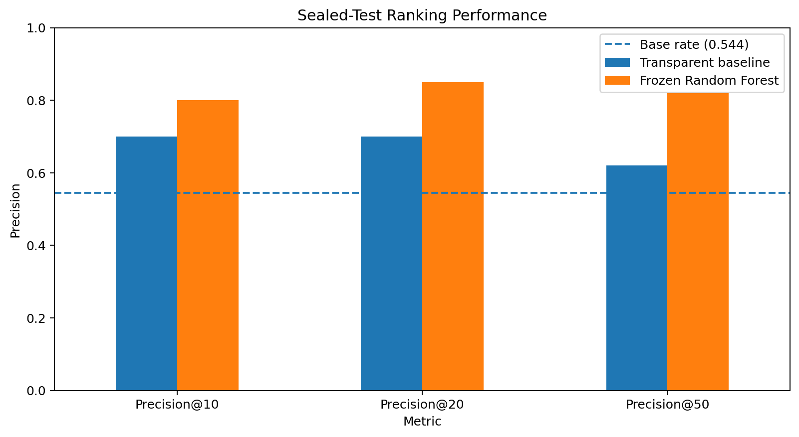
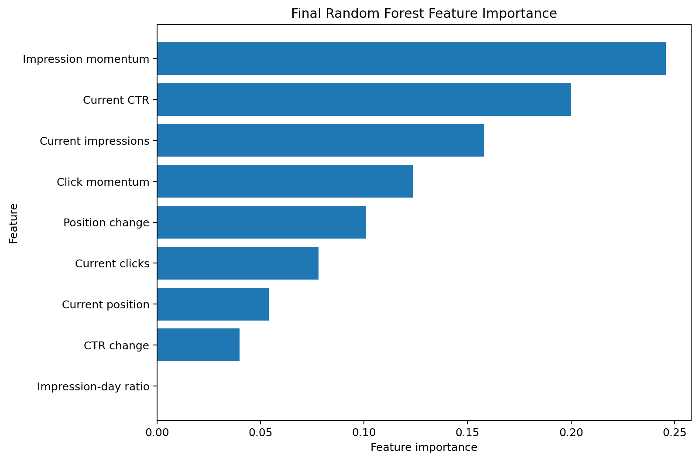

# Can Historical Search Signals Predict Future Content Decline?
## A Time-Aware Ranking Study for Prioritizing Content Review

- **Author:** Muhammad Talha
- **Lane:** Freestyle — Growth / Momentum Prediction
- **Repository:** https://github.com/MuhammadTalha-pk/ML_Internship_FlyRankAI
- **Date:** 6 October 2026

## 0. Abstract

This study asks whether historical Google Search Console performance signals can identify and rank content pages that are at higher risk of a meaningful decline in search visibility during the following month. I used the FlyRank internship warehouse, aggregating daily search-performance records into monthly page-level observations and building leakage-safe features from the prediction month and the month immediately before it. I compared a transparent momentum-based baseline with Logistic Regression and Random Forest models using time-aware validation, then froze the selected model before opening a May→June 2026 sealed holdout. On the sealed holdout, the Random Forest achieved **Precision@50 of 0.820**, compared with **0.620 for the transparent baseline**, while the test-set decline base rate was **0.544**. The final output is a ranked human-review queue designed to help editors decide which pages to inspect first; it is decision-support, not an automatic refresh system or a causal model of Google Search.

## 1. Problem Framing

Editors cannot manually inspect every content page every month. The practical decision is therefore not simply “will this page decline?” but:

> **Which pages should an editor review first when review capacity is limited?**

The unit of analysis is one pseudonymized content page at one monthly prediction date. The system produces a ranked risk score and a priority-review queue. A false positive can waste reviewer time or send a healthy page for unnecessary investigation. A false negative can be more costly when an important page experiences a substantial future visibility decline without being surfaced for review.

Machine learning may help because decline risk can be associated with several signals at the same time: current visibility, clicks, CTR, ranking position, recent changes in impressions and clicks, and changes in position. A learned model can combine these signals in a way that a single fixed rule cannot, but it must earn its value by outperforming a transparent baseline on the same future-period data.

This work does **not** claim to predict Google’s algorithm, identify why a page declined, or prove that refreshing a page will improve performance.

## 2. Data Safety

### Source and grain

The project uses the **FlyRank ML Internship warehouse release** hosted on Hugging Face. The main source is:

`fact_content_daily_performance`

Its daily grain is:

`report_date × client_hash_id × content_hash_id`

The daily table was queried remotely with DuckDB and aggregated before being moved into pandas, so the raw multi-million-row warehouse was never loaded into a notebook dataframe.

Across the seven monthly partitions used in the capstone, from December 2025 through June 2026, the monthly aggregation contained **1,202,786 page-month rows**.

### Time windows

| Role | Prediction month(s) | Outcome month |
|---|---|---|
| Historical context | December 2025 | — |
| Training | January 2026 | February 2026 |
| Training | February 2026 | March 2026 |
| Training | March 2026 | April 2026 |
| Validation | April 2026 | May 2026 |
| Sealed test | May 2026 | June 2026 |

December 2025 was used only as lagged historical context. June 2026 was reserved as the final outcome month and was not used to choose features, target thresholds, model type, baseline logic, or hyperparameters.

### Availability and population rules

Rows were used only where `gsc_data_available IS TRUE`. Unavailable measurements were not interpreted as genuine zeros.

A page-month prediction row required:

- at least **20 GSC-available days** in the previous month;
- at least **20 GSC-available days** in the prediction month;
- at least **20 GSC-available days** in the outcome month;
- at least **100 impressions** in the previous month; and
- at least **100 impressions** in the prediction month.

No minimum future-impressions threshold was applied because doing so would remove genuine declines.

The resulting development frame contained **239,863 rows**:
- **161,149 training rows**
- **78,714 validation rows**

The sealed May→June test frame contained **78,137 rows across 39 pseudonymized clients**.

### Deliberate exclusions

The following were deliberately excluded from predictive inputs:

- client names;
- domains;
- URLs;
- raw private queries;
- credentials;
- product/system flags;
- future-month performance values;
- `trend_direction`;
- `trend_pct`;
- `client_hash_id` as a feature; and
- `content_hash_id` as a feature.

Pseudonymous IDs were retained only for grouping, joining, ranking output, and audit purposes.

## 3. Baseline

The transparent baseline was intentionally simple and readable:

`baseline_score = max(-impression_momentum_log, 0) × log_avg_daily_impressions`

In plain language, pages with more negative recent impression momentum receive higher concern, with greater priority when current visibility is also higher.

This baseline is a fair comparison because it is evaluated on the **same rows, same future-decline target, same validation period, same sealed test period, and same ranking metrics** as the learned model.

On validation, the transparent baseline achieved:

- Precision@10: **0.600**
- Precision@20: **0.700**
- Precision@50: **0.560**
- Average Precision: **0.528**
- ROC-AUC: **0.570**

On the sealed May→June test, it achieved:

- Precision@10: **0.700**
- Precision@20: **0.700**
- Precision@50: **0.620**
- Lift@50: **1.139**
- Average Precision: **0.574**
- ROC-AUC: **0.524**

## 4. Model / Analysis

### Target definition

The final target was:

> `future_decline = 1` when average daily impressions in the following month are at least **30% lower** than average daily impressions in the prediction month; otherwise `0`.

The 30% threshold was selected using development data only. I compared 20%, 30%, and 40% decline definitions before opening the June holdout.

The 20% threshold became a majority-class event in later development months, while the 40% threshold produced relatively few positives in early months. The 30% threshold was retained as a middle ground between practical severity and sufficient positive examples.

### Features

The final model used nine historical features, all available before the outcome month:

1. `log_avg_daily_impressions`
2. `log_avg_daily_clicks`
3. `current_ctr_pct_feature`
4. `current_avg_position_feature`
5. `impression_day_ratio`
6. `impression_momentum_log`
7. `click_momentum_log`
8. `position_change`
9. `ctr_change`

The momentum and change features compare the prediction month with the immediately preceding month. No future-month metric was allowed into the feature set.

### Candidate models

I compared:

- **Logistic Regression** as a readable linear model;
- **Random Forest** as a nonlinear model.

Random seed: **42**

Model selection used the pre-specified operational metric **Precision@50**, because the practical decision is which 50 pages should be reviewed first.

### Validation results before opening June

| Method | Base rate | P@10 | P@20 | P@50 | Average Precision | ROC-AUC |
|---|---:|---:|---:|---:|---:|---:|
| Transparent baseline | 0.464 | 0.600 | 0.700 | 0.560 | 0.528 | 0.570 |
| Logistic Regression | 0.464 | 0.900 | 0.800 | 0.660 | **0.577** | **0.634** |
| Random Forest | 0.464 | 0.900 | **0.850** | **0.900** | 0.555 | 0.612 |

Random Forest was selected because it had the best pre-specified **Precision@50**, even though Logistic Regression performed better on Average Precision and ROC-AUC. The Random Forest was therefore selected for the top-of-queue operational objective, not because it was universally superior.

### Leakage controls

Before opening June:

- all features were checked to be historical;
- no feature name began with `future_`;
- `future_decline` was excluded from predictors;
- `trend_direction` and `trend_pct` were excluded;
- pseudonymous IDs were excluded from predictors;
- no existing product/system decision flag was used;
- the selected model, feature list, target threshold, baseline formula, and hyperparameters were frozen.

The notebook wrote a model-selection receipt before the sealed holdout was opened.

## 5. Evaluation

### Why the split is time-aware

The project used earlier months for training, April→May for validation, and May→June as the final sealed test. This mimics the deployment question more closely than a random row split.

The observed future-decline rate changed substantially over time:

| Prediction month | Future-decline rate |
|---|---:|
| January 2026 | 0.106 |
| February 2026 | 0.153 |
| March 2026 | 0.413 |
| April 2026 | 0.464 |
| May 2026 sealed test | 0.544 |



*Takeaway: label prevalence changed materially over time, reinforcing the need for out-of-time evaluation.*

### Sealed May→June result

After model selection was complete, the frozen Random Forest was retrained on all **239,863 development rows** and evaluated once on the May 2026 prediction frame with June 2026 as the unseen outcome month.

The sealed holdout contained:

- **78,137 eligible page-month rows**
- **39 pseudonymized clients**
- **54.4% future-decline base rate**

| Method | Base rate | P@10 | P@20 | P@50 | Lift@50 | Average Precision | ROC-AUC |
|---|---:|---:|---:|---:|---:|---:|---:|
| Transparent baseline | 0.544 | 0.700 | 0.700 | 0.620 | 1.139 | 0.574 | 0.524 |
| Frozen Random Forest | 0.544 | **0.800** | **0.850** | **0.820** | **1.507** | **0.644** | **0.617** |



*Takeaway: on the sealed future holdout, the model concentrated future declines near the top of the review queue more effectively than the transparent baseline.*

The primary result is **Precision@50 = 0.820**. This means **41 of the model’s top 50 review candidates** met the future-decline definition. The transparent baseline found **31 of 50**.

The model’s Precision@50 was approximately **1.51× the test-set base rate**.

The validation Precision@50 had been 0.900, so the sealed-test value of 0.820 shows some expected temporal generalization loss. The sealed value, not the validation value, is the headline result.

### Error analysis

The sealed top-50 queue contained:

- **41 true declines**
- **9 false positives**

Several false positives still showed negative impression momentum, but other signals such as clicks or position were stable or improving. This suggests that the nonlinear model sometimes ranked pages highly when one part of the signal profile looked risky but the eventual outcome did not cross the 30% threshold.

The first three true declines immediately outside the review queue appeared at ranks **51, 52, and 53**. All three showed negative impression momentum and weak or worsening search positions. This indicates that useful signal continues around the cutoff; rank 50 is an operational capacity limit rather than a natural boundary between “decline” and “safe.”

## 6. Interpretation

The final Random Forest feature importance was:

| Feature | Importance |
|---|---:|
| Impression momentum | 0.2458 |
| Current CTR | 0.1999 |
| Current impressions | 0.1580 |
| Click momentum | 0.1235 |
| Position change | 0.1009 |
| Current clicks | 0.0780 |
| Current position | 0.0539 |
| CTR change | 0.0399 |
| Impression-day ratio | 0.0000 |



*Takeaway: the final model relied most on recent impression momentum, current CTR, current visibility, click momentum, and position movement. These are predictive signals, not causal effects.*

The zero importance for `impression_day_ratio` is a useful negative result: this feature did not contribute materially to the final Random Forest under the fitted specification.

The model’s ROC-AUC of **0.617** is moderate rather than near-perfect. That is consistent with a difficult real-world forecasting problem and supports using the model as a ranking aid rather than an automatic decision system.

### Limitations & honest framing

This project supports **predictive ranking**, not causal inference.

A high model score does not mean that refreshing a page will improve its search performance. The analysis also does not identify or predict Google’s ranking algorithm.

The data form an **unbalanced panel**. Clients enter at different times, monthly page counts vary, and available history differs across entities.

The modeling population requires sufficient data in the **future outcome month** so that the label is measured reliably. This is transparent but important: pages with very sparse or missing future measurement may be excluded, so the evaluated population does not necessarily represent every page in the wider portfolio.

The decline base rate changed materially over time:
- training: **23.8%**
- validation: **46.4%**
- sealed test: **54.4%**

The 30% threshold is a practical proxy rather than a universal definition of decline. A different threshold would create a different decision problem.

The Random Forest score is used for **ranking** and should not be interpreted as a perfectly calibrated probability.

Feature importance reports what the fitted model relied on. It does not show causality or tell an editor which intervention will improve performance.

The strongest supported conclusion is:

> **In the May→June 2026 FlyRank holdout, the frozen Random Forest ranked future-decline cases more effectively near the top of the review queue than the transparent momentum baseline.**

## 7. Recommendation

The final output is a **priority-review queue**, not an automatic refresh list.

The first 50 pages receive:

`review_page_before_refresh_decision`

Pages below the operational cutoff remain:

`monitor`

### Example top-ranked recommendations

| Rank | Pseudonymous content | Model score | Reason code | Recommended action |
|---:|---|---:|---|---|
| 1 | `content_12d95d7f8c2728ad` | 0.783 | visibility_clicks_and_position_weakened | review before refresh decision |
| 2 | `content_b63094bd417908e9` | 0.782 | visibility_momentum_down | review before refresh decision |
| 3 | `content_6a49f91a2da31c46` | 0.778 | visibility_down_position_weaker | review before refresh decision |
| 4 | `content_b9acd1ebff7d34ff` | 0.775 | visibility_clicks_and_position_weakened | review before refresh decision |
| 5 | `content_d2def933ed902af2` | 0.770 | visibility_down_position_weaker | review before refresh decision |
| 6 | `content_a714311e4cf2bbda` | 0.769 | visibility_clicks_and_position_weakened | review before refresh decision |
| 7 | `content_5e20282db1d5b814` | 0.769 | visibility_clicks_and_position_weakened | review before refresh decision |
| 8 | `content_e986eb3ab70fcee6` | 0.769 | visibility_down_position_weaker | review before refresh decision |
| 9 | `content_f36d529e22feabc6` | 0.768 | visibility_clicks_and_position_weakened | review before refresh decision |
| 10 | `content_e23909f72d8ba18e` | 0.766 | visibility_down_position_weaker | review before refresh decision |

The model score is a ranking score, not a calibrated probability.

### How an editor should use the queue

For each priority page, the recommended next step is human investigation:

1. inspect recent search-intent changes;
2. review search-result presentation and CTR context;
3. examine competing content;
4. check for seasonality or demand changes;
5. review recent content changes;
6. compare query/ranking movement where permitted;
7. only then decide whether to refresh, rewrite, consolidate, monitor, or take no action.

Reason codes summarize observable historical signals. They are not causal explanations generated by the model.

## 8. Reproducibility

### Repository

https://github.com/MuhammadTalha-pk/ML_Internship_FlyRankAI

Primary capstone notebook:

`work/notebooks/capstone.ipynb`

### Fresh-clone workflow

```bash
git clone https://github.com/MuhammadTalha-pk/ML_Internship_FlyRankAI.git
cd ML_Internship_FlyRankAI
pip install -r requirements.txt
```

The warehouse is gated on Hugging Face. A read token should be stored securely as `HF_TOKEN` in Colab Secrets or as an environment variable. The token must never be pasted into the public notebook.

Then run:

`work/notebooks/capstone.ipynb`

from top to bottom.

### Randomness

Random seed:

`42`

### Important receipts and artifacts

The notebook creates:

- `work/outputs/capstone_validation_metrics.json`
- `work/outputs/capstone_model_selection.json`
- `work/outputs/capstone_sealed_test_metrics.json`
- `work/outputs/capstone_paper_results.csv`

Generated figures:

- `work/outputs/figures/sealed_test_precision_comparison.png`
- `work/outputs/figures/final_feature_importance.png`
- `work/outputs/figures/decline_rate_over_time.png`

Generated ranked recommendations:

`work/outputs/capstone_ranked_recommendations.csv`

The larger monthly feature caches are working artifacts and do not need to be committed if repository leak guards or `.gitignore` exclude them.

### Sealed-holdout audit trail

The notebook records model selection **before** the June holdout is opened. The final sealed-test receipt records the fixed model, feature list, target definition, prediction month, outcome month, test population size, base rate, and final metrics.

This makes the claim “evaluated once after model selection was frozen” inspectable from the repository rather than relying only on narrative description.

## 9. Acknowledgments & Data Credit

Built on the [FlyRank ML Internship dataset](https://flyrank.ai).

I also acknowledge the FlyRank Machine Learning Internship materials and warehouse documentation that guided the project’s public-safety, leakage-control, baseline, validation, and reproducibility practices.
